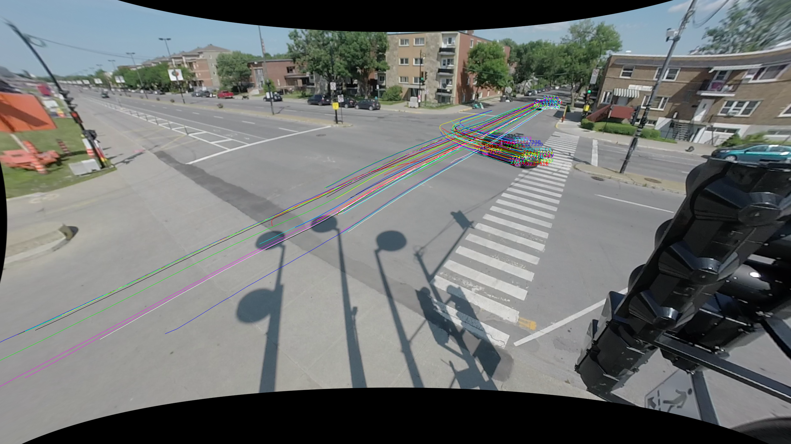

# AV-Interactions-City-Traffic
Low-speed automated shuttles, from EasyMile and Navya, were tested respectively in Montréal, Canada and in Candiac, Canada, in mid and late 2019. Trajectories were extracted from video footage using [TrafficIntelligence](https://bitbucket.org/Nicolas/trafficintelligence).



This repository provides samples of data from trajectories and interactions, captured from both test projects, that were used in a [submission for the 2021 TRB Annual Meeting]() and an [article under review for Accident Analysis and Prevention]().

## Installation
To get started clone this repository and install the required packages.

```sh
$ git clone https://github.com/FinestStone/AV-Interactions-City-Traffic.git
$ cd AV-Interactions-City-Traffic/
$ pip3 install -r requirements.txt
```

## Usage
* The database samples are provided in the [data folder](https://github.com/FinestStone/AV-Interactions-City-Traffic/tree/master/data).
* The [extraction folder](https://github.com/FinestStone/AV-Interactions-City-Traffic/tree/master/extraction) presents examples on extracting information of interest from trajectories and interactions and storing it in a CSV file.
* The [code folder](https://github.com/FinestStone/AV-Interactions-City-Traffic/tree/master/code) contains notebooks that were used to produce the results.
* Figures can be obtained similarly to what is presented in the [imgs folder](https://github.com/FinestStone/AV-Interactions-City-Traffic/tree/master/imgs).

## Credits
### Authors
* **Étienne Beauchamp** - *Initial work* - [FinestStone](https://github.com/FinestStone)

See also the list of [contributors]() who participated in this project.

<!-- ### Citations
This repository is complementary to the following article:

* É. Beauchamp, N. Saunier and M.-S. Cloutier. Study of Automated Shuttle Interactions in City Traffic Using Surrogate Measures ofSafety. In Transportation Research Board Annual Meeting, 2021
-->